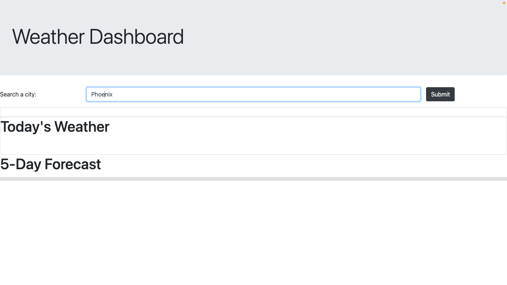
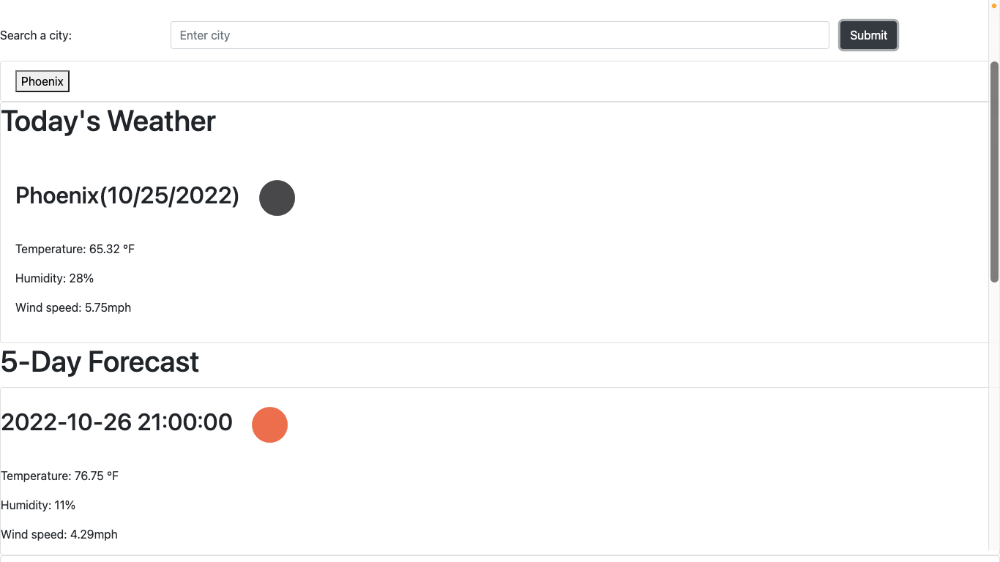
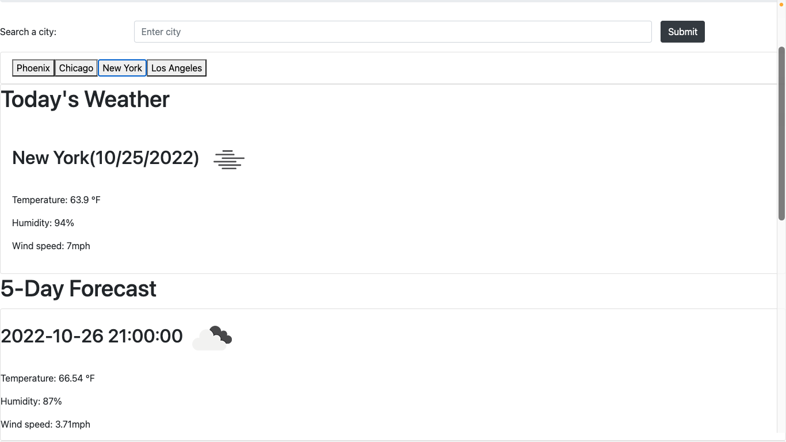

# 06 Server-Side APIs: Weather Dashboard

## Description

This project required the use of HTML, CSS, Javascript, Bootstrap, jQuery, and server-side APIs to complete. This project meets the following acceptance criteria:

## Acceptance Criteria

- GIVEN a weather dashboard with form inputs, WHEN I search for a city, THEN I am presented with current and future conditions for that city and that city is added to the search history
    - If you type a city name into the search box, you will be presented with the current weather forecast, as well as a 5 day forecast. You will also see your searched city added as a button below the search bar.

- WHEN I view current weather conditions for that city, THEN I am presented with the city name, the date, an icon representation of weather conditions, the temperature, the humidity, and the wind speed
    - Underneath the "Today's Weather" heading, you will see the city name, the date, as well as weather icon on one line, and then you will see the temperature, humidity, and wind speed listed below it.

- WHEN I view future weather conditions for that city, THEN I am presented with a 5-day forecast that displays the date, an icon representation of weather conditions, the temperature, the wind speed, and the humidity
    - Underneath the "5-Day Forecast" heading, you will see the date and weather icon on one line, and then you will see the temperature, humidity, and wind speed listed below it.

- WHEN I click on a city in the search history, THEN I am again presented with current and future conditions for that city
    - When an old search city is selected from the list of old searches, it will re-populate the forecast to that city

## Installation

1. First, I set up my HTML with a link to all the necessary style sheets at the top (jQuery, bootstrap, css), and script at the bottom (moment.js, javascript).

2. Next, I set up a jumbotron heading using bootstrap, created a div for the search form, and separate divs for the current weather and 5-day forecast. Bootstrap again was used for styling.

3. I started my javascript file by calling all the appropriate elements and storing them into variables: the search form, button, the searched city inside the form input, a variable to hold all the searched cities, the API Key, and separate variables for the current weather and 5 future days of weateer.

4. I began with an event listener for the submit button which added the cities to local storage, and then ran two functions: a function to append each city as a button to the page (to be used later) and a function to fetch the weather API itself.

5. The fetch API function used javascript to append the current weather to the page first, and then appended the 5-day forecast.

6. Then the same fetch was used in a separate function to apply it to the city buttons that are formed, so that the user could go back to old city searches and check the weather again.

## Usage

To use the page, simply enter any city name in the search bar. It can be all lower case, all upper case, have the first letter capitalized, and even include ", USA" or include any other country code.

Once you have typed in a city, press "submit" and you will see 2 things: (1) the city name will be saved in a list under the search bar, and (2) the weather for today in that city will populate, and the 5-day forecast will populate below.

If you want to go back to a previously searched city, simply click on one of the buttons of your previous searches, and it will take you back to that city's forecast.

## Credits

- Weather forecast API: https://openweathermap.org/forecast5
- Form inputs: https://www.w3schools.com/html/html_forms.asp#:~:text=The%20element%20is%20a,buttons%2C%20submit%20buttons%2C%20etc.
- Local storage: https://w3collective.com/save-data-localstorage-javascript/
- Fullstack Blog API Keys: https://coding-boot-camp.github.io/full-stack/apis/how-to-use-api-keys
- Fetch API docs: https://developer.mozilla.org/en-US/docs/Web/API/Fetch_API/Using_Fetch

## License

MIT License

Copyright (c) 2022 maggierdelaney

Permission is hereby granted, free of charge, to any person obtaining a copy
of this software and associated documentation files (the "Software"), to deal
in the Software without restriction, including without limitation the rights
to use, copy, modify, merge, publish, distribute, sublicense, and/or sell
copies of the Software, and to permit persons to whom the Software is
furnished to do so, subject to the following conditions:

The above copyright notice and this permission notice shall be included in all
copies or substantial portions of the Software.

THE SOFTWARE IS PROVIDED "AS IS", WITHOUT WARRANTY OF ANY KIND, EXPRESS OR
IMPLIED, INCLUDING BUT NOT LIMITED TO THE WARRANTIES OF MERCHANTABILITY,
FITNESS FOR A PARTICULAR PURPOSE AND NONINFRINGEMENT. IN NO EVENT SHALL THE
AUTHORS OR COPYRIGHT HOLDERS BE LIABLE FOR ANY CLAIM, DAMAGES OR OTHER
LIABILITY, WHETHER IN AN ACTION OF CONTRACT, TORT OR OTHERWISE, ARISING FROM,
OUT OF OR IN CONNECTION WITH THE SOFTWARE OR THE USE OR OTHER DEALINGS IN THE
SOFTWARE.